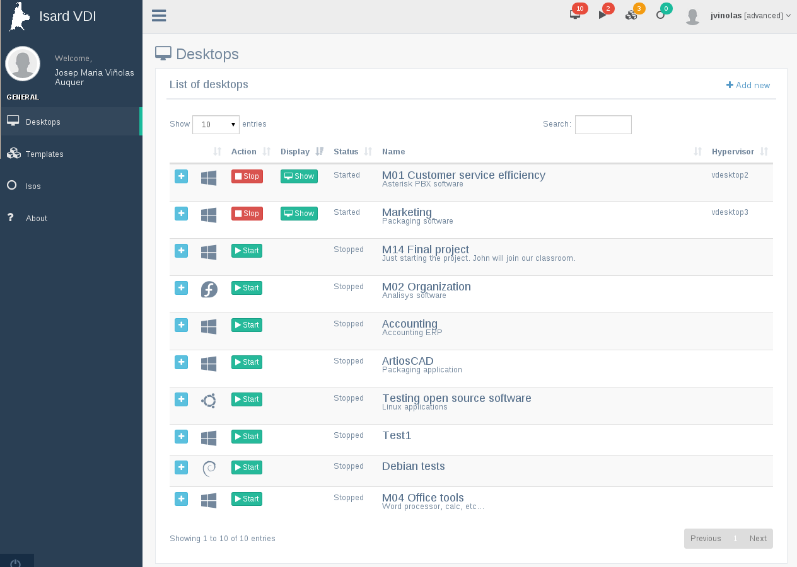
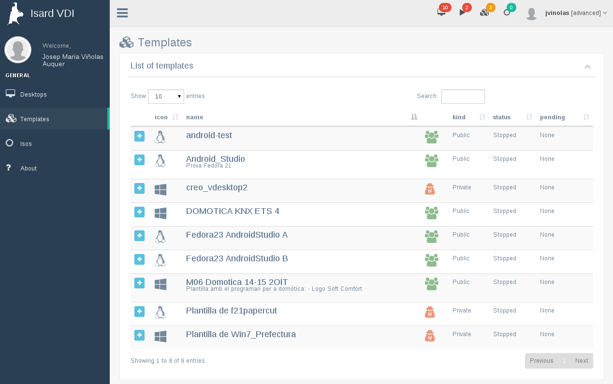
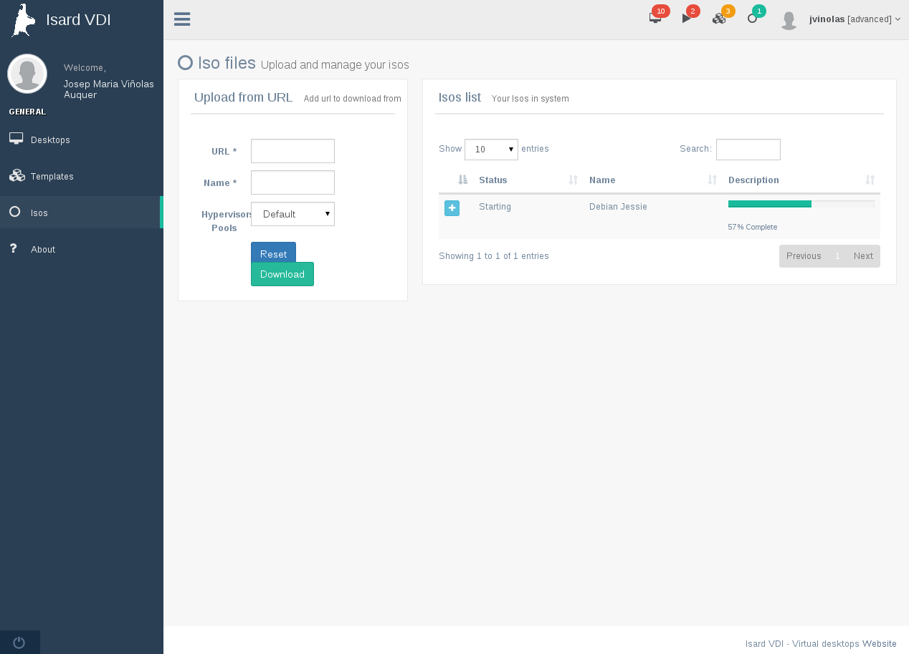
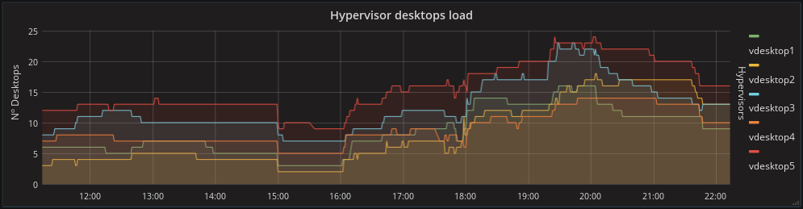

# Isard VDI
VDI deployment based on KVM Linux. Users create and share desktops with any OS and  software through templating in seconds.The Isard engine orchestrates hypervisors and focuses on optimizing desktop virtualization performance.

## Screenshots
User desktops (two at the same time)

Number of desktops per hypervisor during a normal day

Number of desktops per hypervisor during a normal day

Number of desktops per hypervisor during a normal day

Number of desktops per hypervisor during a normal day

#### Features
##### Benefits to users
+ Instant VDI creation and viewer access

##### Benefits to administrators
+ Create multiple hypervisor pools

#### Future lines

#### Success use case

### Authors
+ Josep Maria Viñolas Auquer
+ Alberto Larraz Dalmases

### Support/Contact
Please send us and email to isard.vdi@gmail.com if you have any questions 
